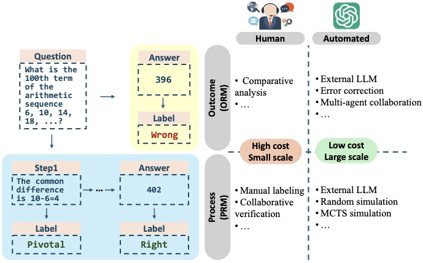

## Towards Large Reasoning Models:fire:: A Survey of Reinforced Reasoning with Large Language Models

---

### Data Construction: from Human Annotation to LLM Automation

#### 3.1 Human Annotation

#### 3.2 LLM Automated Outcome Annotation

#### 3.3 LLM Automated Process Annotation

- Let’s verify step by step (31 May 2023)

- Wizardmath: Empowering mathematical reasoning for large language models via reinforced evol-instruct (18 Aug 2023)

- Math-shepherd: Verify and reinforce llms step-by-step without human annotations (14 Dec 2023)

- Multi-step problem solving through a verifier: An empirical analysis on modelinduced process supervision (5 Feb 2024)

- Improve mathematical reasoning in language models by automated process supervision (5 Jun 2024)

- Rest-mcts*: Llm self-training via process reward guided tree search (6 Jun 2024)

---

### Learning to Reason: from Supervised to Reinforcement Fine-tuning

#### 4.1 Optimizing Pre-trained LLM: Supervised Fine-tuning

#### 4.2 Optimizing Pre-trained LLM: Reinforcement Learning

#### 4.3 Enhancing Multi-step Reasoning with Outcome Reward Model

#### 4.4 Enhancing Multi-step Reasoning with Process Reward Model

- Let’s Verify Step by Step (31 May 2023)
- Selfexplore to avoid the pit: Improving the reasoning capabilities of language models with finegrained rewards (16 Apr 2024)
- Math-shepherd: A label-free step-by-step verifier for llms in mathematical reasoning (14 Dec 2023)
- DeepSeekMath: Pushing the Limits of Mathematical Reasoning in Open Language Models (5 Feb 2024)

Interactive process reward models:
- Archer: Training language model agents via hierarchical multi-turn rl (29 Feb 2024)

Direct preference optimization:
- Step-level value preference optimization for mathematical reasoning (16 Jun 2024)
- Monte carlo tree search boosts reasoning via iterative preference learning (1 May 2024)

#### 4.5 Reinforcement Fine-tuning

